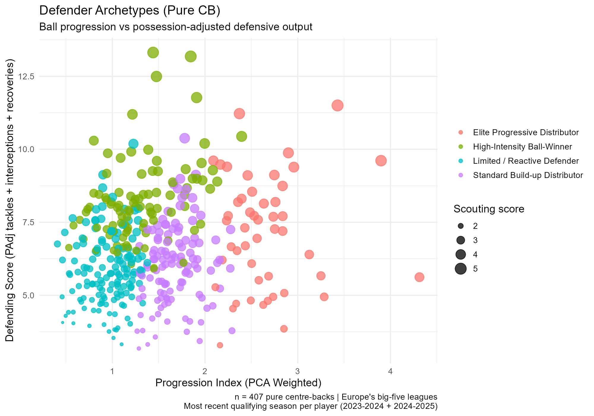
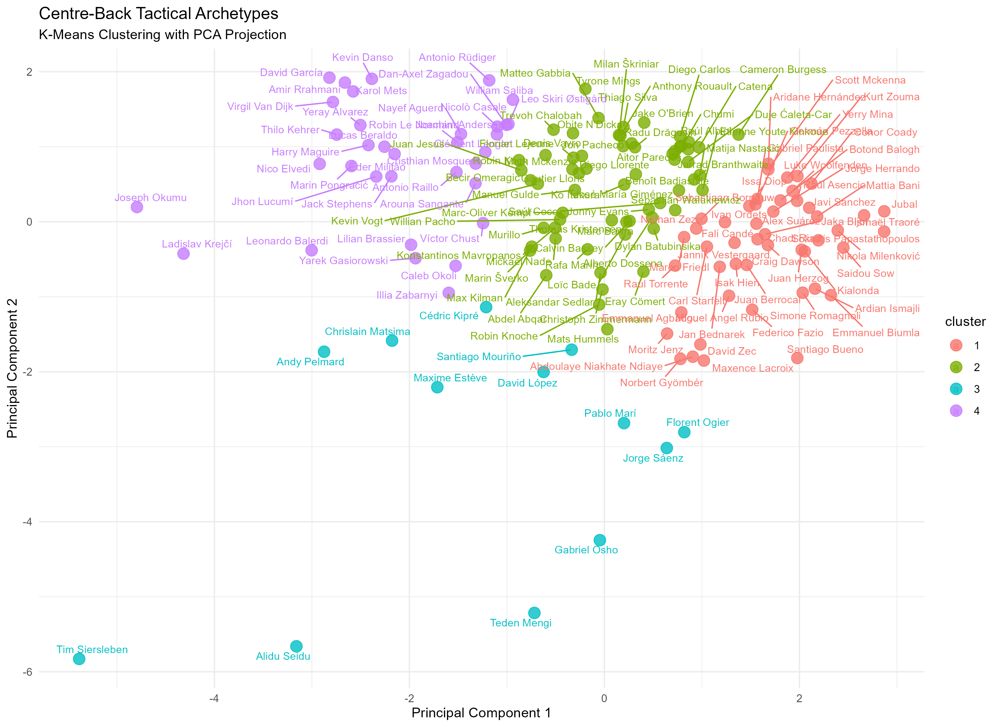
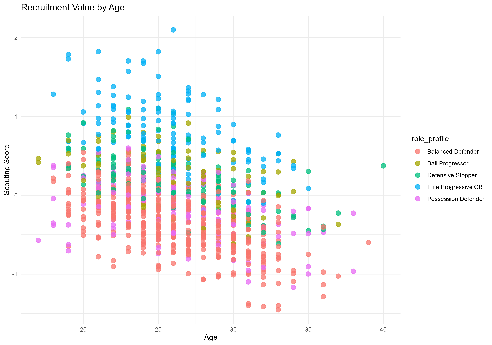
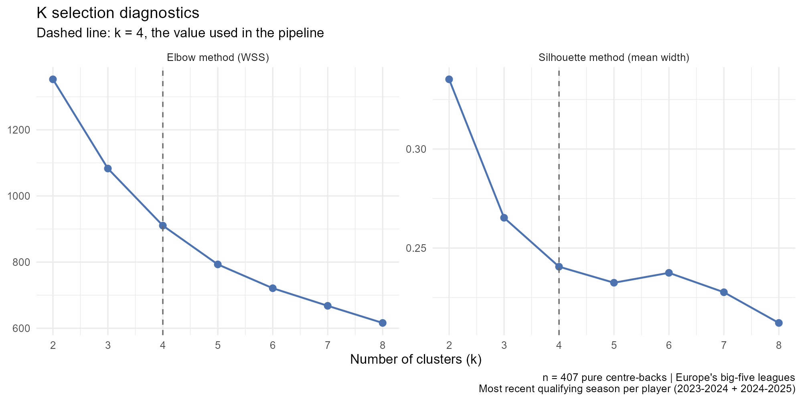
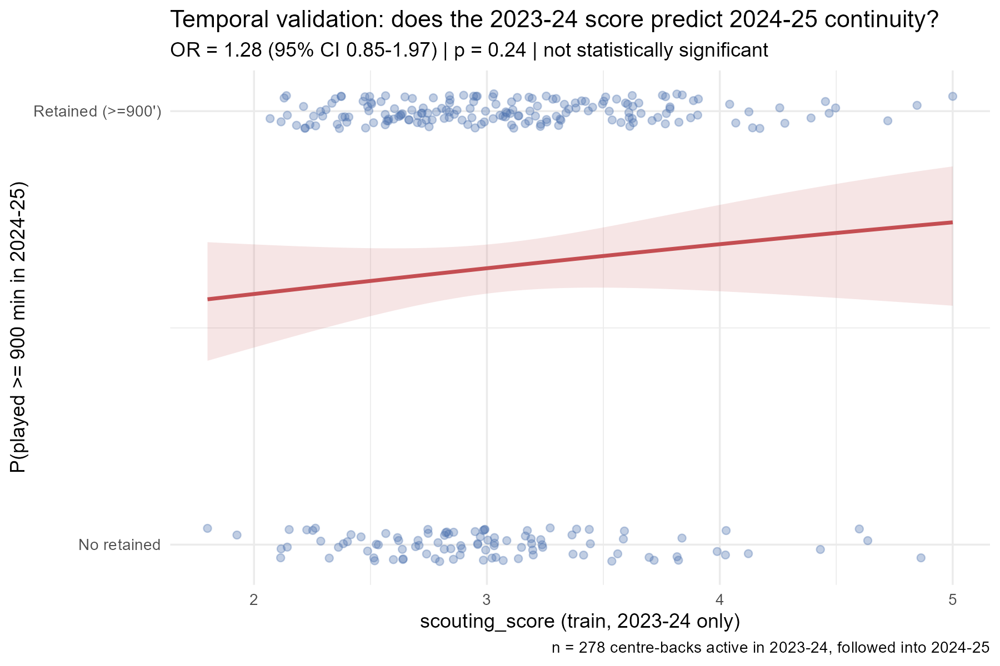

[](README.md)
[](https://www.r-project.org/)
[](LICENSE)

# Identificación de centrales modernos con buena salida de balón

> Framework estadístico multivariante aplicado en R para perfilar, clasificar y encontrar sustitutos estadísticos de centrales en las cinco grandes ligas europeas — con el score compuesto validado fuera de muestra contra resultados reales de 2024-25.

El pipeline combina métricas defensivas ajustadas por posesión, ponderación de variables mediante PCA, clustering K-means y similitud del coseno para ir más allá de las estadísticas brutas y detectar objetivos de reclutamiento con contexto real. Cada decisión de diseño que normalmente se queda sin examinar en un modelo de scouting —el número de clusters, la redundancia entre variables, si el score predice algo real— se comprueba y se reporta a continuación, incluso cuando el resultado es negativo.

---

## Datos y alcance

| | |
|---|---|
| **Fuente** | `data/All_Players_1992-2025.csv` — 92.170 filas jugador-temporada de las cinco grandes ligas |
| **Ventana de análisis** | Temporadas desde 2023–24 en adelante |
| **Unidad de análisis** | Una fila por jugador: **su temporada válida más reciente** |
| **Muestra final** | **407 centrales** — 286 de 2024–25 y 121 de 2023–24 |

Como cada jugador entra con su última temporada válida, la muestra **combina dos campañas**. Esto mantiene cada perfil en su estado de forma más actual —lo que interesa en una herramienta de reclutamiento— pero implica que el ranking no es una comparación estrictamente homogénea de una única temporada. Ver [Limitaciones](#limitaciones).

**Embudo de filtrado**

| Paso | Filas restantes |
|------|-----------------|
| Jugador-temporada desde 2023–24 | 6.997 |
| Posición principal `DF` (se excluyen híbridos `MF`/`FW`), ≥ 900 minutos | 1.104 |
| Filtros posicionales: centros/90 < 0,8; recepciones progresivas/90 < 3,56 (p75); toques en último tercio/90 < 0,20 (p75) | 570 |
| Temporada más reciente por jugador | **407 jugadores únicos** |

Los dos últimos filtros posicionales existen para eliminar laterales y carrileros que el dataset de origen sigue etiquetando como `DF`. Un cribado de outliers multivariante (D² de Mahalanobis, ver [Diagnósticos estadísticos](#diagnósticos-estadísticos)) marca a 20 de los 407 como combinaciones estadísticamente atípicas de estas variables de filtrado — se reportan, no se eliminan, porque "atípico" no es lo mismo que "erróneo".

---

## Metodología

### 1. Ingeniería de variables
Todas las métricas están normalizadas por 90 minutos. Los indicadores compuestos son:

- **Índice de progresión** — combinación ponderada de pases progresivos, conducciones progresivas y pases clave por 90. Los pesos no se eligen a mano: son los loadings absolutos normalizados del PC1 de un PCA sobre esas tres variables (**0,346**, **0,352** y **0,302** respectivamente). El PC1 explica el **66,4%** de la varianza conjunta de las tres variables, que es justo lo que justifica reducirlas a un único eje ponderado en vez de, por ejemplo, quedarse con las dos primeras componentes.
- **Defensa ajustada por posesión (PAdj)** — la posesión del equipo se estima a partir del volumen de pases frente a la media de la liga, y después un multiplicador sigmoideo `2 / (1 + exp(-0,1 × (posesión − 50)))` reescala entradas, intercepciones y recuperaciones. Los defensas de equipos dominantes tienen menos oportunidades defensivas, así que sus conteos brutos se ajustan al alza.
- **Scouting score** — la métrica maestra de clasificación:

  ```
  scouting_score = índice_progresión        × 0,40
                 + defending_score_PAdj      × 0,30
                 + (precisión_pase / 100)    × 0,10
                 + age_score                 × 0,20
  ```

  La curva de edad premia las ventanas de máximo rendimiento (`≤24 → 1,00`; `≤28 → 0,95`; `≤31 → 0,85`; `≤33 → 0,70`; resto `0,50`). Un chequeo de VIF confirma que los cuatro pilares no son redundantes entre sí (todos con VIF ≤ 1,13 — ver diagnósticos abajo), así que cada uno aporta información distinta en lugar de contar la misma señal dos veces.

### 2. Clustering y roles tácticos
Los jugadores se segmentan en cuatro arquetipos con K-means (`k = 4`, `nstart = 50`, `set.seed(123)`) sobre variables de progresión y defensa PAdj tipificadas. Las etiquetas de rol **no están fijadas a mano**: el pipeline lee los centroides y asigna los nombres por eliminación (mayor progresión → *Elite Progressive Distributor*; después mayor volumen defensivo → *High-Intensity Ball-Winner*; después menor progresión → *Limited / Reactive Defender*; el restante → *Standard Build-up Distributor*). `k = 4` es una elección deliberada y declarada, no un valor por defecto — ver [Diagnósticos estadísticos](#diagnósticos-estadísticos) para la evidencia de codo/silueta detrás de esa decisión.

### 3. Motor de similitud
Una función de similitud del coseno sobre el espacio de características estandarizado. Ingiere el nombre de cualquier jugador objetivo y devuelve las coincidencias estadísticas más cercanas, para planificación de sucesiones.

---

## Hallazgos principales

**Mejores scouting scores** — Sead Kolašinac (Atalanta, **5,08**) lidera el ranking general, seguido de Riccardo Calafiori (Bologna, **4,98**) y Timo Hübers (Colonia, **4,84**).

**Líderes en progresión** — Iñigo Martínez (Barcelona, **4,31**) domina el índice de progresión, combinando un volumen muy alto de pases progresivos con conducción de élite. Nico Schlotterbeck (Dortmund, **3,90**) actúa como referencia secundaria.

**Defensa ajustada por posesión** — tras normalizar el dominio del equipo, Timo Hübers (**13,31** PAdj combinado) y Riccardo Calafiori (**13,18**) emergen como los recuperadores más activos de la muestra.

**Objetivos de mercado sub-24** — Riccardo Calafiori (21, 4,98) es el más destacado. Otros perfiles jóvenes de élite señalados por el algoritmo: Nico Schlotterbeck (24, 4,73), Alidu Seidu (23, 4,62), Wilfried Singo (23, 4,60) y Giorgio Scalvini (19, 4,58).

**Motor de similitud** — consultado contra el perfil mejor clasificado (Sead Kolašinac), el motor devuelve a Mario Gila (**97,1%** de similitud del coseno), Javi Rodríguez (95,9%) y Facundo Medina (95,3%).

**Distribución de arquetipos** — Limited / Reactive Defender (145), Standard Build-up Distributor (117), High-Intensity Ball-Winner (97), Elite Progressive Distributor (48).

Para un desglose completo a nivel de jugador, casos de estudio por cluster y shortlists de reclutamiento, consulta el **[informe de análisis táctico](docs/TACTICAL_ANALYSIS.es.md)**.

---

## Figuras

**Progresión vs defensa ajustada por posesión**, coloreado por rol algorítmico y con tamaño según scouting score. La separación entre distribuidores (derecha) y recuperadores (arriba) es precisamente el trade-off que arbitra el score compuesto.



**Arquetipos K-means proyectados sobre las dos primeras componentes principales.** Solo se etiquetan los 15 primeros por scouting score.



**Edad vs scouting score.** La zona superior izquierda —jugadores jóvenes con scores compuestos altos— es donde está el valor de reclutamiento.



---

## Diagnósticos estadísticos

Comprobaciones que normalmente se quedan implícitas en un índice de scouting, ejecutadas y reportadas de forma explícita:

| Diagnóstico | Método | Resultado | Veredicto |
|---|---|---|---|
| Cribado de outliers multivariantes | D² de Mahalanobis vs. límite k+3√(2k) sobre las 7 variables de filtrado/scoring | 20 / 407 jugadores (4,9%) marcados | Se reportan, no se eliminan — ver [`qc_mahalanobis_outliers.csv`](outputs/tables/qc_mahalanobis_outliers.csv) |
| Justificación de los pesos PCA | Varianza explicada por el PC1 de las 3 variables de progresión | PC1 = 66,4%, PC2 = 21,0%, PC3 = 12,6% | El dominio del PC1 respalda usar solo sus loadings como pesos |
| Multicolinealidad | VIF sobre cada grupo de variables del compuesto (`car::vif`) | Todos los VIF ≤ 1,75 (umbral de alarma: 10) | Sin redundancia entre variables en ningún nivel del score |
| Número de clusters (`k`) | Codo (WSS) + silueta para k = 2–8 | Óptimo estadístico k = 2 (silueta 0,335); el k = 4 usado tiene silueta 0,241 | k = 4 es un trade-off de interpretabilidad declarado, no el máximo estadístico — ver figura abajo |
| Validez del clustering | K-means vs. clustering jerárquico independiente (enlace de Ward) | Índice de Rand Ajustado = 0,419, correlación cofenética = 0,586, 75,2% de acuerdo por fila | Acuerdo moderado y no trivial entre dos algoritmos no relacionados — los 4 arquetipos son una estructura real, aunque no nítidamente separada |



**Sobre el trade-off de `k = 4`:** el óptimo global del método de la silueta es k = 2, que colapsa la muestra en esencialmente "progresivo vs. limitado" — una división mucho más gruesa que la narrativa táctica de cuatro roles sobre la que se construye el resto del proyecto. El ancho de silueta en k = 4 (0,241) está justo en el límite de lo que la regla de Kaufman & Rousseeuw llama "estructura débil" (< 0,25). Esto se declara en vez de ocultarse: los cuatro arquetipos se eligen por la granularidad relevante para el scouting, y el contraste jerárquico (ARI 0,419) muestra que reflejan una señal real, aunque moderada, en los datos, y no un artefacto de K-means.

---

## Validación del modelo

Un scouting score solo es útil si es capaz de decir algo cierto sobre jugadores que no ha visto. Para comprobarlo, se reajustó todo el pipeline usando **solo datos de 2023-24** (incluidos los pesos del PCA, para no filtrar información de 2024-25), y se contrastó contra lo que realmente ocurrió la temporada siguiente — una partición Train/Test temporal genuina, no k-fold aleatorio, porque aquí el orden temporal es precisamente lo que no puede filtrarse.

**Planteamiento:** 278 centrales activos en 2023-24. Outcome: ¿jugó el jugador ≥ 900 minutos en 2024-25 (`retained`)? El 64,0% sí lo hizo.

| Modelo | Predictor(es) | Resultado clave | AIC |
|---|---|---|---|
| Solo intercepto | — | referencia | 365,2 |
| Regresión logística | `scouting_score` | OR = 1,28 (IC95% 0,85–1,97), **p = 0,24 — no significativo** | 365,8 |
| Regresión logística | 4 componentes por separado | `age_score` OR = 22,6, **p = 0,001**; `progression_index` OR = 1,60, p = 0,053; `defending_score` y `pass_completion` no significativos | 354,2 |

**Resultado principal: el `scouting_score` compuesto no predice de forma significativa si un jugador sigue jugando la temporada siguiente** (pseudo-R² de McFadden = 0,004 — prácticamente nulo). Entre los jugadores que sí fueron retenidos, su score tampoco se correlaciona con cuántos minutos acabaron jugando (ρ de Spearman = −0,01, p = 0,90).

**Por qué, y por qué esto no es un fallo del score:** descomponer el compuesto en sus cuatro variables muestra exactamente dónde está la señal. `age_score` por sí solo es un predictor fuerte y muy significativo de la retención (los jugadores mayores tienen menos probabilidad de seguir jugando al año siguiente, un efecto de etapa de carrera nada sorprendente). Pero `age_score` solo pesa un **20%** del compuesto por diseño, porque el score está construido para clasificar *capacidad futbolística*, no para predecir *supervivencia en la muestra*. Que una señal de edad fuerte se diluya con un 80% de peso en métricas de capacidad que no predicen la retención a corto plazo es exactamente lo que debería pasar si el score está haciendo su trabajo. Un test de razón de verosimilitud lo confirma: el modelo de 4 parámetros sin restringir ajusta significativamente mejor que el compuesto de 1 parámetro (LRT χ², p < 0,001) — la ponderación fija 40/30/10/20 es una restricción real y medible, no gratuita.

Como contraste descriptivo (no causal), la tasa de retención sí se alinea con los propios arquetipos del algoritmo: Elite Progressive Distributor 70,6% (n=34), Standard Build-up Distributor 69,8% (n=86), High-Intensity Ball-Winner 66,1% (n=59), Limited / Reactive Defender 55,6% (n=99).



**Qué muestra esta validación y qué no:** "jugar 900+ minutos la temporada siguiente" es un proxy débil e indirecto de la calidad de scouting — depende al menos tanto de lesiones, profundidad de plantilla y el sistema de un entrenador como de la capacidad del jugador, y un gran perfil de scouting no garantiza titularidad en el club comprador. Un resultado nulo aquí no significa que el score esté mal; significa que la retención bruta es el objetivo equivocado para validarlo, y esa limitación ahora es explícita en vez de darse por hecha. Salida completa del modelo: [`temporal_validation_results.csv`](outputs/tables/temporal_validation_results.csv).

---

## Reproducir el análisis

Requiere R (≥ 4.1) y cinco paquetes (dos de ellos, `car` y `cluster`, se usan solo con `::` y nunca se cargan enteros, para evitar que `MASS` —dependencia de `car`— enmascare silenciosamente `dplyr::select()`):

```bash
Rscript -e "install.packages(c('tidyverse','ggrepel','proxy','factoextra','car'), repos='https://cloud.r-project.org')"
```

Después, desde la raíz del repositorio:

```bash
Rscript scripts/run_all.R
```

El pipeline es determinista (`set.seed(123)` en cada ejecución de K-means) y regenera todos los archivos de `outputs/` en seis pasos: comprobación de dependencias → proxy de posesión → scoring → clustering → motor de similitud → **validación temporal**. Los pasos se ejecutan en orden y se detienen ante el primer error, ya que cada uno consume la salida del anterior.

**Paso opcional y manual:** `scripts/scripts_optional_real_possession.R` sustituye el proxy de posesión estimada por el porcentaje real de posesión de FBref, vía el paquete [`worldfootballR`](https://jaseziv.github.io/worldfootballR/). No forma parte de `run_all.R` y no puede ejecutarse en un entorno sandbox/CI —FBref bloquea IPs de centros de datos con Cloudflare, algo confirmado mientras se construía este pipeline— pero sí funciona desde una conexión residencial normal. Los comentarios al principio del script explican exactamente cómo conectar su salida de vuelta al pipeline.

---

## Archivos generados

### Gráficas (`outputs/figures/`)
| Archivo | Descripción |
| --- | --- |
| `defender_archetypes.png` | Índice de progresión vs defending score, coloreado por perfil de rol y tamaño por scouting score |
| `cluster_pca_visualization.png` | Proyección PCA 2D con arquetipos K-means, top 15 etiquetado |
| `recruitment_value.png` | Edad vs scouting score, para localizar ineficiencias de mercado |
| `cluster_k_selection.png` | Diagnóstico de codo (WSS) y silueta detrás de la elección k = 4 |
| `temporal_validation.png` | Ajuste logístico de la retención 2024-25 frente al scouting score de 2023-24 |

### Tablas (`outputs/tables/`)
| Archivo | Descripción |
| --- | --- |
| `top_recruitment_targets.csv` | Top 25 jugadores por scouting score general |
| `market_inefficiency_targets.csv` | Jugadores sub-24 por encima del percentil 80 en scouting score |
| `progression_ranking.csv` | Top 20 jugadores por índice de progresión |
| `defensive_ranking.csv` | Top 20 jugadores por defending score ajustado por posesión |
| `padj_defensive_metrics.csv` | Dataset maestro completo con todas las estimaciones de contexto y estadísticas PAdj |
| `cluster_profiles.csv` | Estadísticas medias por cluster / rol asignado |
| `final_scouting_dashboard.csv` | Lista completa de jugadores con roles tácticos asignados por el algoritmo |
| `player_similarity_results.csv` | Mejores coincidencias por similitud del coseno para la consulta objetivo |
| `qc_mahalanobis_outliers.csv` | Cribado de outliers multivariantes (marcados, no eliminados) |
| `pca_variance_explained.csv` | Varianza explicada por componente, PCA de progresión |
| `vif_diagnostics.csv` | Chequeo de multicolinealidad para cada grupo de variables del compuesto |
| `cluster_k_selection.csv` | WSS y ancho medio de silueta para k = 2–8 |
| `kmeans_vs_hierarchical_agreement.csv` | Tabla de contingencia K-means vs. clustering jerárquico |
| `temporal_validation_results.csv` | Salida completa del GLM (train 2023-24 / test 2024-25) |
| `temporal_validation_predictions.csv` | Datos de predicción por jugador detrás de la validación |
| `temporal_validation_retention_by_role.csv` | Tasa de retención por arquetipo táctico |

---

## Limitaciones

Se declaran explícitamente porque acotan cómo debe leerse el ranking:

- **La posesión es un proxy, no una medición.** Se infiere del volumen de pases del equipo frente a la media de la liga, así que un equipo de poca posesión que juegue mucho pase corto quedará sobreestimado. `scripts/scripts_optional_real_possession.R` lo sustituye por datos reales de FBref, pero solo al ejecutarse en local (ver [Reproducir el análisis](#reproducir-el-análisis)).
- **La muestra combina dos temporadas.** Los jugadores se comparan en su campaña válida más reciente, lo cual es correcto para estado de forma pero no para un corte transversal limpio.
- **Los pesos del compuesto los fija el analista, no se ajustan estadísticamente.** El reparto 40/30/10/20 y la curva de edad codifican una filosofía de reclutamiento. Se comprueba que no son redundantes entre sí (VIF, todos ≤ 1,13) y se testa su validez predictiva fuera de muestra (ver [Validación del modelo](#validación-del-modelo)) — pero "comprobado" no es "optimizado": no se ha usado ninguna variable outcome para ajustarlos.
- **`k = 4` es un trade-off declarado, no el óptimo estadístico.** Tanto el codo como la silueta favorecen k = 2; se mantuvo k = 4 por interpretabilidad táctica, con el contraste jerárquico (ARI 0,419) como evidencia de que la división en cuatro sigue reflejando una estructura real, aunque moderada. Detalle completo en [Diagnósticos estadísticos](#diagnósticos-estadísticos).
- **Los minutos de la temporada siguiente son un objetivo de validación débil e indirecto.** La validación temporal no encontró relación significativa entre `scouting_score` y la retención en 2024-25 — esperable, ya que la retención depende de lesiones, profundidad de plantilla y contexto de club que ninguna métrica de scouting captura, y el score está deliberadamente más orientado a la capacidad (80%) que al único componente (la edad) que sí predice la retención.
- **Los traspasos a mitad de temporada** se gestionan a nivel de fila según el dataset de origen; el contexto PAdj de un jugador refleja únicamente el equipo de esa fila.
- **El modelo no ve** disponibilidad ni historial de lesiones, duelos aéreos, errores defensivos, situación contractual ni valor de mercado. Es una herramienta de preselección, no una decisión de fichaje.

---

## Tecnologías

- R
- tidyverse (dplyr, tibble, ggplot2)
- ggrepel
- proxy (similitud del coseno)
- cluster (ancho de silueta, paquete "recommended" de R base)
- car (VIF)
- stats::glm, stats::hclust, stats::mahalanobis, stats::prcomp (R base)
- worldfootballR (opcional, datos reales de posesión solo en local)

---

## Estructura del repositorio

```text
football-data-analysis/
│
├── data/
│   ├── All_Players_1992-2025.csv        # dataset original
│   ├── player_stats_2024_2025.csv       # extracto reducido de una temporada
│   └── processed/
│       ├── defenders_processed.csv      # tabla maestra con scores
│       └── team_possession_proxy.csv    # estimaciones de posesión + multiplicadores PAdj
│
├── scripts/
│   ├── setup_packages.R                     # comprobación de dependencias
│   ├── scripts_padj_metrics.R               # proxy de posesión + multiplicadores PAdj
│   ├── scripts_scouting.R                   # filtrado, pesos PCA, QC, VIF, scores compuestos
│   ├── scripts_clustering.R                 # selección de k, K-means, contraste jerárquico, figuras
│   ├── scripts_similarity_engine.R          # similitud del coseno
│   ├── scripts_temporal_validation.R        # validación GLM train/test (2023-24 -> 2024-25)
│   ├── scripts_optional_real_possession.R   # [opcional/manual] posesión real de FBref vía worldfootballR
│   └── run_all.R                            # pipeline maestro (6 pasos)
│
├── outputs/
│   ├── figures/
│   └── tables/
│
├── docs/
│   ├── TACTICAL_ANALYSIS.md
│   └── TACTICAL_ANALYSIS.es.md
│
├── README.md
├── README.es.md
└── LICENSE
```

---

## Licencia

Publicado bajo [Licencia MIT](LICENSE).

---

## Autor

**Adrián Gómez Conde**

Bioestadístico

Modelización estadística · análisis multivariante · analítica deportiva aplicada
