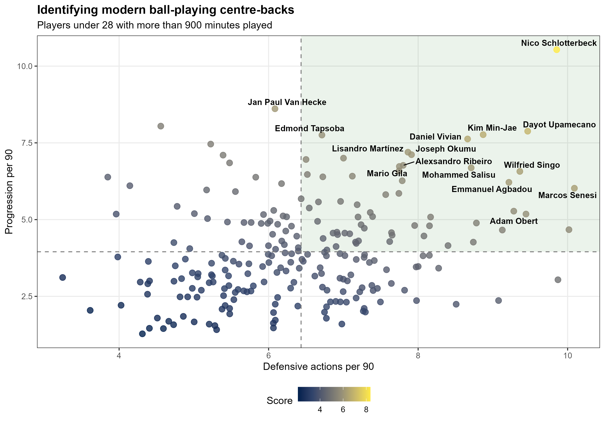

# Identifying Modern Ball-Playing Centre-Backs

This project applies statistical profiling and football scouting methodology to identify modern centre-backs capable of combining defensive solidity with progressive ball progression.

The analysis focuses on players from Europe's top leagues using advanced passing and defensive metrics derived from FBref data.

---

# Project Objective

Modern football increasingly demands centre-backs who can:

- defend proactively
- progress the ball under pressure
- contribute to build-up play
- initiate attacking sequences

This project aims to identify players who excel in both defensive activity and progression metrics.

---

# Methodology

Players were filtered using the following criteria:

- Position = Defender (DF)
- Age ≤ 28
- Minimum 900 minutes played
- Low crossing volume to exclude attacking fullbacks

Custom per-90 metrics were created to evaluate:

- Progressive passing
- Progressive carries
- Defensive activity
- Chance creation

A custom scoring model was then applied to rank player profiles.

---

# Key Metrics

## Progression per 90
Combination of:
- Progressive passes
- Progressive carries

## Defensive actions per 90
Combination of:
- Tackles
- Interceptions
- Recoveries

## Modern CB Score
Weighted model combining:
- progression
- defensive activity
- key passing contribution

---

# Visualization

The scatterplot identifies defenders who perform above average in both:

- defensive activity
- ball progression

The upper-right quadrant highlights the most complete modern centre-backs.

---

# Technologies Used

- R
- tidyverse
- ggplot2
- ggrepel
- viridis

---

# Output Example

---

# Author

Adrián Gómez Conde

MSc Biostatistics candidate focused on statistical modelling, data analysis and football analytics.
