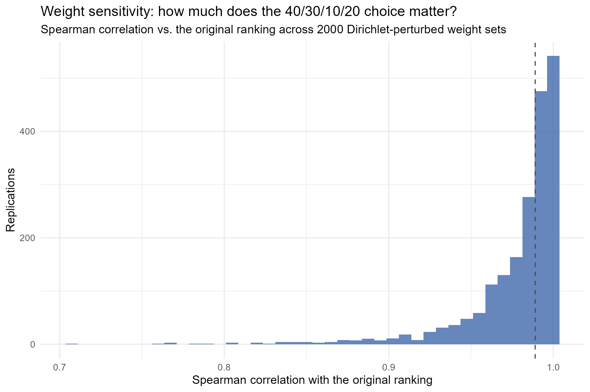
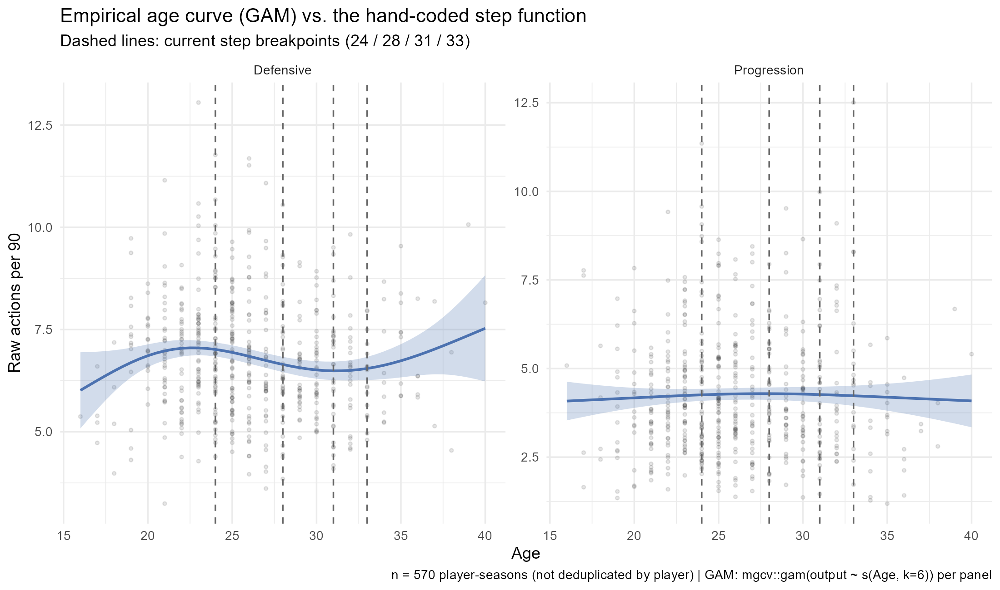

[](README.es.md)
[](https://www.r-project.org/)
[](LICENSE)

# Identifying modern centre-backs with strong ball-progression capabilities

> Applied multivariate scouting framework in R to profile, rank, and find statistical replacements for centre-backs across Europe's top five leagues — with empirical-Bayes reliability weighting, a disclosed weight-sensitivity analysis, and the composite score validated out-of-time against real 2024-25 outcomes.

The pipeline combines possession-adjusted defensive metrics, PCA-driven feature weighting, empirical-Bayes shrinkage of small-sample rates, K-means clustering, and cosine similarity to move beyond raw counting stats and surface genuinely context-aware recruitment targets. Every design choice that is normally left unexamined in a scouting model — the number of clusters, the redundancy between inputs, how much a small sample of minutes can be trusted, how much the hand-picked weights matter, whether the score predicts anything real — is checked and reported below, including where the checks come back negative.

---

## Data and scope

| | |
|---|---|
| **Source** | `data/All_Players_1992-2025.csv` — 92,170 player-season rows, Europe's big-five leagues |
| **Analysis window** | Seasons from 2023–24 onwards |
| **Unit of analysis** | One row per player: **their most recent qualifying season** |
| **Final sample** | **407 centre-backs** — 286 from 2024–25, 121 from 2023–24 |

Because each player enters with their latest qualifying season, the sample **mixes two campaigns**. This keeps every profile at its most current form — the priority for a recruitment tool — but it means the ranking is not a strictly like-for-like single-season comparison. See [Limitations](#limitations).

**Sample funnel**

| Step | Rows remaining |
|------|----------------|
| Player-seasons from 2023–24 onwards | 6,997 |
| Primary position `DF` (hybrid `MF`/`FW` excluded), ≥ 900 minutes | 1,104 |
| Positional filters: crosses/90 < 0.8, progressive receptions/90 < 3.56 (p75), attacking-third touches/90 < 0.20 (p75) | 570 |
| Most recent season per player | **407 unique players** |

The last two positional filters exist to strip out full-backs and wing-backs that the source data still labels `DF`. A multivariate outlier screen (Mahalanobis D², see [Statistical diagnostics](#statistical-diagnostics)) flags 20 of the 407 as statistically atypical combinations of these filtering variables — they are reported, not removed, since "atypical" is not the same as "wrong".

**The data itself is 2023-25.** A 2025-26 refresh is possible but not automatic from a hosted environment — see [Keeping the data current](#keeping-the-data-current).

---

## Methodology

### 1. Reliability-weighted rates (empirical-Bayes shrinkage)
A player with 900 minutes (10 matches) and one with 3,420 minutes (38 matches) can show the same tackles-per-90 rate, but the first estimate is far noisier. Treating them as equally reliable is a real statistical error, and it specifically inflates exactly the low-minute, U-24 "market inefficiency" profiles this project is meant to surface.

Every count-based rate (progressive passes, progressive carries, key passes, tackles, interceptions, recoveries) is corrected with the textbook Poisson-Gamma conjugate empirical-Bayes estimator — the same mechanism behind Efron & Morris's (1975) baseball batting-average shrinkage, applied here to defensive actions instead of hits. `MASS::glm.nb()` fits `count ~ offset(log(minutes/90))` per metric, giving the population mean rate (μ) and dispersion (θ); the posterior mean rate for player *i* is `(θ + count_i) / (θ/μ + minutes_i/90)` — shrunk toward the population mean in inverse proportion to their minutes played. The correction is real and where it should be: mean absolute shrinkage in the bottom quartile of minutes played is **2–3× larger** than in the top quartile, across all six metrics.

### 2. Feature engineering
All metrics are normalised per 90 minutes, using the shrunk rates above. The composite indicators are:

- **Progression index** — weighted combination of progressive passes, progressive carries, and key passes per 90. Weights are not hand-picked: they are the normalised absolute PC1 loadings of a PCA on those three variables (**0.36 / 0.36 / 0.28**). PC1 explains **66.8%** of the joint variance of the three inputs, which is what justifies collapsing them onto a single weighted axis instead of, say, keeping the first two components.
- **Possession-adjusted defending (PAdj)** — team possession is estimated from passing volume relative to the league average, then a sigmoidal multiplier `2 / (1 + exp(-0.1 × (possession − 50)))` rescales tackles, interceptions, and recoveries. Defenders in dominant sides get fewer defensive opportunities, so their raw counts are adjusted upwards.
- **Scouting score** — the master ranking metric:

  ```
  scouting_score = progression_index      × 0.40
                 + PAdj_defending_score   × 0.30
                 + (pass_completion / 100) × 0.10
                 + age_score               × 0.20
  ```

  The age curve rewards peak windows (`≤24 → 1.00`, `≤28 → 0.95`, `≤31 → 0.85`, `≤33 → 0.70`, else `0.50`). A VIF check confirms the four pillars aren't redundant with each other (all VIF ≤ 1.13 — see diagnostics below), so each one contributes distinct information. A GAM check of the age curve itself is in [Statistical diagnostics](#statistical-diagnostics).

### 3. How much does the 40/30/10/20 choice matter?
The weights encode a recruitment philosophy, not a statistical fit — so their influence is measured directly. 2,000 alternative weight sets are drawn from a Dirichlet distribution centred on 40/30/10/20 (a principled way to simulate "reasonable disagreement" about the weighting), and the ranking is recomputed each time. See [Statistical diagnostics](#statistical-diagnostics) for the result.

### 4. Clustering and tactical roles
Players are segmented into four archetypes with K-means (`k = 4`, `nstart = 50`, `set.seed(123)`) on z-scored progression and PAdj defensive variables. Role labels are **not hardcoded** — the pipeline reads the cluster centroids and assigns names by elimination (highest progression → *Elite Progressive Distributor*, then highest defensive volume → *High-Intensity Ball-Winner*, then lowest progression → *Limited / Reactive Defender*, remainder → *Standard Build-up Distributor*). `k = 4` is a deliberate, disclosed choice rather than a default — see [Statistical diagnostics](#statistical-diagnostics) for the elbow/silhouette evidence behind it.

### 5. Similarity engine
A cosine-similarity function over the standardised feature space. It takes any target player's name and returns the closest statistical matches, for succession planning.

---

## Key findings

**Top scouting scores** — Sead Kolašinac (Atalanta, **4.75**) tops the master ranking, followed by Riccardo Calafiori (Bologna, **4.65**) and Timo Hübers (Köln, **4.56**).

**Progression leaders** — Iñigo Martínez (Barcelona, **4.07**) leads the progression index, combining a high progressive-pass volume with elite carrying. Nico Schlotterbeck (Dortmund, **3.62**) is the runner-up reference point.

**Possession-adjusted defending** — after normalising for team dominance, Timo Hübers (**12.36** combined PAdj) and Riccardo Calafiori (**12.16**) emerge as the most active ball-winners in the sample.

**U-24 market targets** — Riccardo Calafiori (21, 4.65) is the standout. Other elite young profiles flagged by the algorithm: Nico Schlotterbeck (24, 4.44), Wilfried Singo (23, 4.35), and Giorgio Scalvini (19, 4.33). Alidu Seidu (23) is still on the list at 3.99, but seven places lower than before reliability weighting — see why below.

**Similarity engine** — queried against the top-ranked profile (Sead Kolašinac), the engine returns Mario Gila (**96.7%** cosine similarity), Javi Rodríguez (95.0%), and César Azpilicueta (94.3%).

**Archetype distribution** — Limited / Reactive Defender (157), Standard Build-up Distributor (147), High-Intensity Ball-Winner (67), Elite Progressive Distributor (36). Shrinkage pulled a meaningful number of small-sample "extreme" profiles back toward the two middle archetypes — see below.

For full player-level breakdowns, cluster case studies, and recruitment shortlists, see the **[tactical analysis report](docs/TACTICAL_ANALYSIS.md)**.

---

## Figures

**Progression vs possession-adjusted defending**, coloured by algorithmic role and sized by scouting score. The separation between distributors (right) and ball-winners (top) is what the composite score trades off.


**K-means archetypes projected onto the first two principal components.** Only the top 15 by scouting score are labelled.


**Age vs scouting score.** The upper-left region — young players with high composite scores — is where the recruitment value sits.


---

## Statistical diagnostics

Checks that are usually left implicit in a scouting index, run and reported explicitly:

| Diagnostic | Method | Result | Verdict |
|---|---|---|---|
| Small-sample reliability | Empirical-Bayes Poisson-Gamma shrinkage (`MASS::glm.nb`) on 6 rate metrics | Bottom-minutes quartile shrunk 2–3× more than top-minutes quartile | Low-minute breakout rates are now discounted for their sample size, not treated as equally reliable |
| Weight sensitivity | 2,000 Dirichlet-perturbed reweightings of 40/30/10/20 | Median Spearman ρ = **0.989** vs. original ranking; Top-10 overlap **87.9%** on average | The ranking is broadly robust to reasonable disagreement about the weights — with named exceptions, see below |
| Multivariate outlier screen | Mahalanobis D² vs. cutoff k+3√(2k) on the 7 filtering/scoring inputs | 20 / 407 players (4.9%) flagged | Reported, not removed — see [`qc_mahalanobis_outliers.csv`](outputs/tables/qc_mahalanobis_outliers.csv) |
| PCA weight justification | Variance explained by PC1 of the 3 progression inputs | PC1 = 66.8%, PC2 = 21.1%, PC3 = 12.2% | PC1 dominance supports using only its loadings as weights |
| Multicollinearity | VIF on each group of composite inputs (`car::vif`) | All VIF ≤ 1.77 (threshold for concern: 10) | No redundancy between inputs at any level of the score |
| Age curve | GAM (`mgcv::gam`) of raw output vs. age, progression and defensive output fit separately | Defensive: p = 0.0056 but R² = 0.025 (small); Progression: p = 0.66 (no relationship) | Weak evidence either way — the hand-coded step curve is not contradicted, but it isn't strongly supported either; not replaced this round, see figure below |
| Cluster count (`k`) | Elbow (WSS) + silhouette across k = 2–8 | Statistical optimum k = 2 (silhouette 0.344); k = 4 used has silhouette 0.259 | k = 4 is a disclosed interpretability trade-off, not the statistical maximum |
| Cluster validity | K-means vs. independent hierarchical clustering (Ward's method) | Adjusted Rand Index = 0.295, cophenetic correlation = 0.496, 62.4% row-agreement | Weaker agreement than before shrinkage (was 0.419) — shrinking real between-player variance along with the noise softened the cluster boundaries too; still well above chance |


**Weight sensitivity, by name:** most of the current Top-10 barely moves under 2,000 plausible reweightings — Kolašinac stays top-10 in 100% of replications, Schlotterbeck and Singo in 99.7%, Calafiori in 98.5%. But the bottom of the Top-10 is genuinely fragile: **Alidu Seidu (52.0%) and Mohammed Salisu (49.4%) are essentially coin-flips** — whether they make the cut depends on the specific weighting almost as much as on their underlying numbers. That's a materially different, more honest claim than "here is the top 10."



**What shrinkage changed, concretely:** Alidu Seidu played only 1,131 minutes before his January 2024 transfer. His raw tackles/90 (2.55) and interceptions/90 (1.99) looked elite; the reliability-weighted estimates (2.08 and 1.59) are still good but no longer exceptional — some of his standout PAdj numbers were a small-sample hot streak, not a stable rate. He dropped from **#5 (4.62)** in the previous, unshrunk version of this model to **#10 (3.99)**. This is exactly the kind of correction the method is designed to make, and exactly the profile — low minutes, high hype — where it matters most.



---

## Model validation

A scouting score is only as useful as its ability to say something true about players it hasn't seen. To test this, the whole pipeline — including the shrinkage step — was refit using **only 2023-24 data**, then checked against what actually happened the following season — a genuine temporal train/test split, not random k-fold, since the ordering of time is exactly what must not leak.

**Setup:** 278 centre-backs active in 2023-24. Outcome: did the player play ≥ 900 minutes in 2024-25 (`retained`)? 64.0% did.

| Model | Predictor(s) | Key result | AIC |
|---|---|---|---|
| Intercept only | — | baseline | 365.2 |
| Logistic regression | `scouting_score` | OR = 1.38 (95% CI 0.83–2.32), **p = 0.22 — not significant** | 365.7 |
| Logistic regression | 4 components separately | `age_score` OR = 22.5, **p = 0.0015**; `progression_index` OR = 1.72, p = 0.049; `defending_score` and `pass_completion` not significant | 354.1 |

**Headline result, unchanged by shrinkage: the composite `scouting_score` does not significantly predict whether a player keeps playing next season.** `age_score` alone is a strong, significant predictor of retention (younger players are simply more likely to still be playing), but it carries only **20%** of the composite's weight by design, because the score ranks *footballing ability*, not *survival in the sample*. A likelihood-ratio test confirms the fixed weighting is a real, measurable constraint on this specific prediction task (χ², p < 0.001).

As a descriptive cross-check (not causal), retention rate does line up with the algorithm's own archetypes: Elite Progressive Distributor 81.5% (n=27), High-Intensity Ball-Winner 64.1% (n=39), Standard Build-up Distributor 63.1% (n=111), Limited / Reactive Defender 60.4% (n=101).


**What this validation does and doesn't show:** "played 900+ minutes next season" is a weak, indirect proxy for scouting quality — it's driven at least as much by injuries, squad depth, and a manager's system as by ability, and a great scouting profile does not guarantee a starting shirt at the buying club. A null result here does not mean the score is wrong; it means crude retention is the wrong target to validate it against. Full model output: [`temporal_validation_results.csv`](outputs/tables/temporal_validation_results.csv).

---

## Does this actually find anything the market didn't already know?

Short answer: **no, not really — and that's an important, disclosed finding, not a footnote.** Checking the top names in this report against what actually happened in the transfer market:

| Player | This report | What actually happened |
|---|---|---|
| Alidu Seidu | "Market inefficiency" at Clermont, 2023-24 | Sold to Rennes for **€11M** on **29 January 2024** — mid-way through the very season this model scores him on, after just 14 Ligue 1 appearances |
| Riccardo Calafiori | U-24 standout, 2023-24 | Sold Bologna → Arsenal for **~€45-49M** in summer 2024, on the back of a standout Euro 2024 |
| Wilfried Singo | U-24 standout | Already sold Torino → Monaco for **€10M** in summer 2023, before the analysis window even starts |
| Giorgio Scalvini | Highest-scoring teenager | Atalanta declared him "unsellable" at a **€60M** valuation with four Premier League clubs reportedly interested |
| Mario Gila | Top cosine-similarity match | Real Madrid academy product; Lazio already paid **€6M** for him in 2022, two years before this analysis |

Every headline name here was already scouted, priced, and in most cases already sold by professional recruitment departments with far richer information (video, medical, personal character assessment) — usually before the season this model scores them on had even finished. This model has good precision at identifying quality; it has **no discovery lead-time advantage over the real market**, and no public counting-stat model reasonably could.

This is why `scripts/scripts_optional_market_value_residuals.R` exists: it replaces the current, arbitrary "U-24 + top 20th percentile" definition of "market inefficiency" with a real one — regressing log(market value) on `scouting_score`, age, and league, and flagging players whose *actual* Transfermarkt price sits statistically below what their performance predicts. That is a genuine inefficiency claim; a percentile cutoff never was. See [Keeping the data current](#keeping-the-data-current) — like the possession and fresh-season scripts, it needs to run locally.

---

## Keeping the data current

The data is 2023-25. Three optional, local-only scripts extend it — none of them can run from a hosted/sandboxed environment, for the reasons stated in each:

| Script | What it adds | Why it's manual |
|---|---|---|
| `scripts_ingest_fresh_season.R` | Harmonises a 2025-26 season CSV (e.g. the community-maintained, weekly-updated [Kaggle FBref mirror](https://www.kaggle.com/datasets/hubertsidorowicz/football-players-stats-2025-2026)) into the pipeline's schema | Kaggle requires an authenticated account/API token |
| `scripts_optional_real_possession.R` | Replaces the estimated possession proxy with real FBref possession % via [`worldfootballR`](https://jaseziv.github.io/worldfootballR/) | FBref blocks data-centre IPs with Cloudflare (confirmed while building this pipeline) |
| `scripts_optional_market_value_residuals.R` | Real Transfermarkt market values, and a proper regression-residual definition of "undervalued" (see above) | `transfermarkt.com` doesn't even resolve by DNS from this build environment — a stronger restriction than FBref's |

All three are defensively coded (column auto-detection, explicit failure messages, no silent wrong numbers) and were verified as much as possible without live access — see the comment header of each script for exactly what was and wasn't tested.

---

## Reproducing the analysis

Requires R (≥ 4.1) and six packages (`car` and `MASS` are used only via `::` and never attached, since `MASS` masks `dplyr::select()`; `cluster` and `mgcv` ship with R itself):

```bash
Rscript -e "install.packages(c('tidyverse','ggrepel','proxy','factoextra','car','MASS'), repos='https://cloud.r-project.org')"
```

Then, from the repository root:

```bash
Rscript scripts/run_all.R
```

The pipeline is deterministic (`set.seed(123)` for every K-means and Dirichlet draw) and regenerates every file in `outputs/` in six steps: dependency check → possession proxy → scoring (shrinkage, PCA, VIF, weight sensitivity, GAM) → clustering → similarity engine → temporal validation. Steps run in order and stop on the first error, since each one consumes the previous one's output.

---

## Generated outputs

### Figures (`outputs/figures/`)
| File | Description |
|------|-------------|
| `defender_archetypes.png` | Progression index vs defending score, coloured by role profile and sized by scouting score |
| `cluster_pca_visualization.png` | 2D PCA projection with K-means archetypes, top 15 labelled |
| `recruitment_value.png` | Age vs scouting score, to locate market inefficiencies |
| `cluster_k_selection.png` | Elbow (WSS) and silhouette diagnostics behind the choice of k = 4 |
| `weight_sensitivity.png` | Distribution of ranking correlations across 2,000 Dirichlet-perturbed weight sets |
| `age_curve_gam.png` | Empirical GAM age curve (progression and defensive output, separately) vs. the hand-coded step function |
| `temporal_validation.png` | Logistic fit of 2024-25 retention against the 2023-24 scouting score |
| `market_value_residuals.png` | *(local-only)* Predicted vs. actual market value |

### Tables (`outputs/tables/`)
| File | Description |
|------|-------------|
| `top_recruitment_targets.csv` | Top 25 players by overall scouting score |
| `market_inefficiency_targets.csv` | U-24 players above the 80th percentile scouting score (percentile-based; see the residual-based alternative above) |
| `progression_ranking.csv` | Top 20 players by progression index |
| `defensive_ranking.csv` | Top 20 players by possession-adjusted defending score |
| `padj_defensive_metrics.csv` | Full master dataset — shrunk and raw rates, PAdj stats, all context estimates |
| `cluster_profiles.csv` | Mean statistics per cluster / assigned role |
| `final_scouting_dashboard.csv` | Full player list with algorithm-assigned tactical roles |
| `player_similarity_results.csv` | Top cosine-similarity matches for the target query |
| `shrinkage_diagnostics.csv` | Mean shrinkage magnitude by minutes-played quartile, per metric |
| `weight_sensitivity_top10.csv` | Per-player Top-10 retention rate across reweightings |
| `weight_sensitivity_replications.csv` | Raw output of all 2,000 Dirichlet replications |
| `qc_mahalanobis_outliers.csv` | Multivariate outlier screen (flagged, not removed) |
| `pca_variance_explained.csv` | Variance explained per component, progression PCA |
| `vif_diagnostics.csv` | Multicollinearity check for every group of composite inputs |
| `age_curve_gam.csv` | Fitted GAM values, progression and defensive output vs. age |
| `cluster_k_selection.csv` | WSS and mean silhouette width for k = 2–8 |
| `kmeans_vs_hierarchical_agreement.csv` | K-means vs. hierarchical clustering contingency table |
| `temporal_validation_results.csv` | Full GLM output (train 2023-24 / test 2024-25) |
| `temporal_validation_predictions.csv` | Per-player prediction data behind the validation |
| `temporal_validation_retention_by_role.csv` | Retention rate by tactical archetype |
| `market_inefficiency_residuals.csv` | *(local-only)* Regression-residual "undervalued" ranking |
| `market_value_unmatched_players.csv` | *(local-only)* FBref players not matched to a Transfermarkt value |

---

## Limitations

Stated explicitly, because they bound how the ranking should be read:

- **Possession is a proxy, not a measurement.** It is inferred from team passing volume against the league average. `scripts_optional_real_possession.R` replaces it with real FBref data, but only when run locally.
- **The sample mixes two seasons, and is 2023-25.** See [Keeping the data current](#keeping-the-data-current) for the (local-only) path to 2025-26.
- **The composite weights are analyst-set, not statistically fitted.** They are checked for internal redundancy (VIF ≤ 1.13), tested for predictive validity out-of-time, and stress-tested against 2,000 reasonable reweightings — but "checked" is not "optimised"; no outcome variable was used to fit them, and the bottom of the Top-10 (Seidu, Salisu) is genuinely sensitive to the exact choice.
- **`k = 4` is a disclosed trade-off, not the statistical optimum**, and cluster separation weakened after shrinkage (ARI dropped from 0.419 to 0.295) — shrinking noise pulled some real between-player variance in with it. The clusters are still well above chance agreement with an independent method, but should be read as broad tendencies, not sharp categories.
- **The age curve is a hand-coded step function** that a GAM check neither strongly confirms nor contradicts (progression output shows no age relationship at all in this data; defensive output shows a small, statistically real one). Not replaced this round for lack of a confident alternative.
- **Next-season minutes are a weak, indirect validation target**, unaffected by the shrinkage update — retention is driven by injuries, squad depth, and club context that no scouting metric captures.
- **This model has essentially no lead-time advantage over professional scouting.** See [Does this actually find anything the market didn't already know?](#does-this-actually-find-anything-the-market-didnt-already-know) — every headline name here was already known to real recruitment departments, usually before the scored season had even ended.
- **Mid-season transfers** are handled at row level by the source data; a player's PAdj context reflects the squad on that row only.
- **The model is blind to** availability and injury history, aerial duels, defensive errors, contract situation, and (absent the optional residual script) market value. It is a shortlisting tool, not a signing decision.

---

## Technologies

- R
- tidyverse (dplyr, tibble, ggplot2)
- ggrepel
- proxy (cosine similarity)
- MASS (`glm.nb` — empirical-Bayes shrinkage)
- cluster (silhouette width, base R "recommended" package)
- mgcv (GAM age-curve diagnostic, base R "recommended" package)
- car (VIF)
- stats::glm, stats::hclust, stats::mahalanobis, stats::prcomp, stats::rgamma (base R)
- worldfootballR (optional, local-only real possession and market value data)

---

## Repository structure

```
football-data-analysis/
│
├── data/
│   ├── All_Players_1992-2025.csv        # raw source dataset
│   ├── player_stats_2024_2025.csv       # slim single-season extract
│   ├── raw/                             # drop a fresh-season CSV here (see scripts_ingest_fresh_season.R)
│   └── processed/
│       ├── defenders_processed.csv      # scored master table
│       └── team_possession_proxy.csv    # possession estimates + PAdj multipliers
│
├── scripts/
│   ├── setup_packages.R                         # dependency check
│   ├── scripts_padj_metrics.R                   # possession proxy + PAdj multipliers
│   ├── scripts_scouting.R                       # shrinkage, PCA, QC, VIF, weight sensitivity, GAM, composite scores
│   ├── scripts_clustering.R                     # k selection, K-means, hierarchical cross-check, figures
│   ├── scripts_similarity_engine.R              # cosine similarity
│   ├── scripts_temporal_validation.R            # train/test GLM validation (2023-24 -> 2024-25)
│   ├── scripts_ingest_fresh_season.R            # [optional/manual] harmonise a 2025-26 CSV (e.g. Kaggle)
│   ├── scripts_optional_real_possession.R       # [optional/manual] real FBref possession via worldfootballR
│   ├── scripts_optional_market_value_residuals.R # [optional/manual] real market values + residual inefficiency model
│   └── run_all.R                                # master pipeline (6 steps)
│
├── outputs/
│   ├── figures/
│   └── tables/
│
├── docs/
│   ├── TACTICAL_ANALYSIS.md
│   └── TACTICAL_ANALYSIS.es.md
│
├── README.md
├── README.es.md
└── LICENSE
```

---

## License

Released under the [MIT License](LICENSE).

---

## Author

**Adrián Gómez Conde**

MSc Biostatistics candidate

Statistical modelling · multivariate analysis · applied sports analytics
